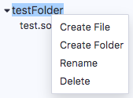

File Explorers
=============

To get to the File Explorers module - click the file explorers icon.

The basic files explorer lists all the files stored in your browser's **browser storage**.
You can see them in the **browser** folder. 

**Important Note:** Clearing the browser storage will **permanently delete** all the
solidity files stored there. This is an inherent limitation of a browser-based IDE.  However, if you want to store files outside of the browser and on your computer's filesystem, use [Remixd](remixd.html) or use the [desktop version of Remix-IDE](https://github.com/ethereum/remix-desktop/releases/). RemixD enables you to have access to a selected folder on your hard drive. Remix Desktop is a version of Remix-IDE in an Electron app.

You can rename, remove or
add new files to the file explorer.

We will start by reviewing the icons in the image above.

The book icon - **A.** is the link to the module's documentation.

The icons to the right of the **browser** file explorer in the image above only appear for browser storage. 

Create new File
---------------

The icon marked **B.** above. Creates a new file.

Publish to Gist
---------------

The icon marked **C.** above. Publishes all files from the browser folder to a gist.  Only file in the root of **browser** will be published.  Files in subfolders will not be publish to the Gist.
Gist API has changed in 2018 and **requires** users to be authenticated to be able to publish a gist.

Click [this link](https://github.com/settings/tokens) to Github tokens setup and select Generate new token. Then check the **Create gists** checkbox and generate a new token.

Take the token and paste it in Remix's **Settings** module in the **Github Access Token** section. And then click Save. Now you should be able to use the feature.

Create a folder
---------------

The icon marked **D.** above.  Creates a new folder in **browser** file explorer.

Context Menu (Right Click)
-----------------------------
Right click on a file or a folder and the **context menu** will appear. 

You can rename or delete a selected file or a folder. You can also create a folder. 

To create a file with the context menu, right click on a folder to get the **Create File** option. A file will be created inside that folder. 

The functionality of the context menu also works with RemixD (which gives you have access to a folder on your hard drive).  

**Note:** When working with RemixD, you need to open and close the **localhost** folder to refresh the view.
