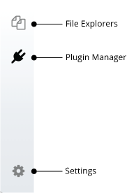

Remix-IDE Layout
==============

The new structure
--------------------

1. Icon Panel - click to change which plugin appears in the Side Panel
2. Side Panel - Most but not all plugins will have their GUI here.
3. Main Panel - In the old layout this was just for editing files.  In the tabs can be plugins or files for the IDE to compile.
4. Terminal - where you will see the results of your interactions with the GUI's.  Also you can run scripts here.

Icon Panel at Page Load
-----------------------
When you load remix - the icon panel show these icons by default.

Everything in remix is now a plugin...  so the **[Plugin Manager](#plugin-manager)** is very important.
In the old layout, each basic task in remix was separated into the tabs.  Now these tabs are plugins.  

But to activate a half a dozen plugins - (or however many you are using) each time the page load is **tedious**.  So learn about the **[Environments](#environments)**.

Homepage
--------

The homepage is located in a tab in the Main Panel.  

You can also get there by clicking the remix logo at the top of the icon panel.

### Environments
Clicking on one of the environment buttons loads up a collection of plugins.  We currently have a **Solidity** Button and a **Vyper** button.  In the future you will be able to save your own environment.

To see all the plugins go to the **plugin manager** - by selecting the plug in the icon panel. 
 

The environment buttons are time & sanity savers - so you don't need to go to the plugin manager to get started everytime you load the page.   

Plugin Manager
---------------

In order to make Remix flexible for integrating changes into its functionality and for integrating remix into other projects (your's for example), we've now made everything a plugin.  This means that you only load the functionality you need.  It also means that you need a place to turn off and on plugins - as your needs change.  This all happens in the plug manager.  

The Plugin Manager is also the place you go when you are creating your own plugin and you want to load your local plugin into Remix. In that case you'd click on the "Connect to a Local Plugin" link at the top of the Plugin Manager panel.

Themes
---------------

So you want to work on Remix with a dark theme or a gray theme or just a different theme that the one you are currently looking at?  Go to the settings tab and at the bottom is a choice of lots of bootstrap based themes.

 
