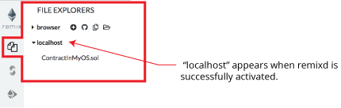

Remixd: Access your Local Filesystem 
=========================================

`remixd` is an npm module. Its purpose is to give the remix web
application access to a folder on your local computer.

The code of `remixd` is
[here](https://github.com/ethereum/remixd) .

`remixd` can be globally installed using the following command:
`npm install -g remixd`

Or just install it in the directory of your choice by removing the -g flag:
`npm install remixd`

Then from the terminal, the command `remixd -s <absolute-path-to-the-shared-folder> --remix-ide <your-remix-ide-URL-instance>` will start `remixd` and will share the given folder with remix-ide. 

For example, to use remixd with Remix IDE ( and not the alpha version) use this command: 
`remixd -s <absolute-path-to-the-shared-folder> --remix-ide https://remix.ethereum.org`

Make sure that if you use https://remix.ethereum.org (secure http) in the remixd command (like in the example above), that you are also pointing your browser to https://remix.ethereum.org and not to http://remix.ethereum.org (plain old insecure http).  Or if you want to use http in the browser use http in the remixd command.


The folder is shared using a websocket connection between `Remix IDE`
and `remixd`.

Be sure the user executing `remixd` has read/write permission on the
folder.

There is an option to run remixd in read-only mode, use `--read-only` flag.

**Warning!**

`remixd` provides `full read and write access` to the given folder for `any
application` that can access the `TCP port 65520` on your local host.

From `Remix IDE`, in the Plugin Manager you need to activate the remixd plugin.  

A modal dialog will ask confirmation

Accepting this dialog will start a session.

If you do not have `remixd` running in the background - another modal will open up and it will say: 

```
Cannot connect to the remixd daemon. 
Please make sure you have the remixd running in the background.
```

Assuming you don't get the 2nd modal, your connection to the remixd daemon is successful. The shared folder will be available in the file explorer.

**When you click the activation of remixd is successful - there will NOT be an icon that loads in the icon panel.**

Click the File Explorers icon and in the swap panel you should now see the folder for `localhost`.

Click on the `localhost connection` icon:




