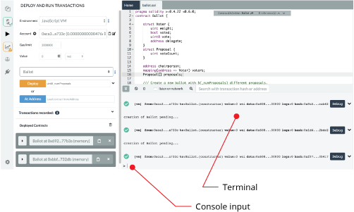

Terminal
========

Features, available in the terminal:

-   It integrates a JavaScript interpreter and the `web3` object. It
    enables the execution of the JavaScript script which interacts with
    the current context. (note that `web3` is only available if the
    `web provider` or `injected provider` mode is selected).
-   It displays important actions made while interacting with the Remix
    IDE (i.e. sending a new transaction).
-   It displays transactions that are mined in the current context. You
    can choose to display all transactions or only transactions that
    refers to the contracts Remix knows (e.g transaction created from
    the Remix IDE).
-   It allows searching for the data and clearing the logs from the
    terminal.
-   You can run scripts by inputting them at the bottom after the `>`.

