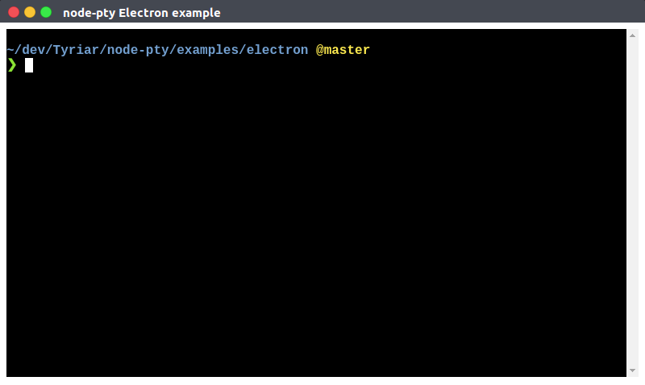

This is a minimal example of getting a terminal running in Electron using [node-pty](https://github.com/Tyriar/node-pty) and [xterm.js](https://github.com/sourcelair/xterm.js).



## Usage

```bash
# Install npm dependencies using Electron's version of V8
./npm_install.sh
# Launch the app
npm start
```
