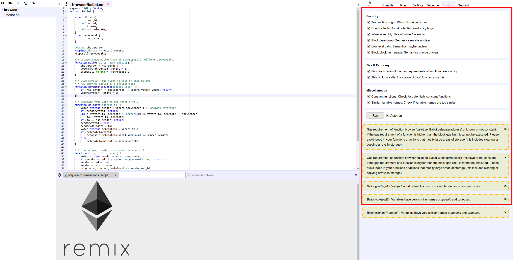

Analysis
========

This section gives information about the last compilation.
A new analysis is by default run at each compilation.

It gives detailed information about the contract code and is a good way to avoid code mistakes and enforce best practices.

Here the list of analyzers:

    - Security:
        - Transaction origin: Warn if tx.origin is used
        - Check effects: Avoid potential reentrancy bugs
        - Inline assembly: Use of Inline Assembly
        - Block timestamp: Semantics maybe unclear
        - Low level calls: Semantics maybe unclear
        - Block.blockhash usage: Semantics maybe unclear

    - Gas & Economy:
        - Gas costs: Warn if the gas requirements of functions are too high
        - This on local calls: Invocation of local functions via this

    - Miscellaneous:
        - Constant functions: Check for potentially constant functions
        - Similar variable names: Check if variable names are too similar
