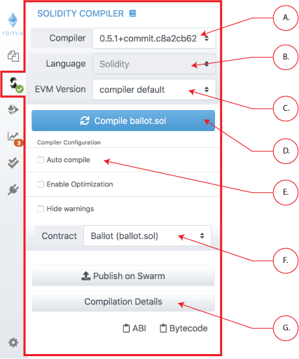

Compiler (Solidity)
===================

Clicking the Solidity icon in the icon panel brings you to the Solidty Compiler.

Compiling is triggered when you click the compile button ( **A. in image below**). If you want the file to be compiled each time the file is saved or when another file is selected - check the auto compile checkbox ( **B. in image below**).  

If the contract has a lot of dependencies it can take a while to compile - so you use autocompilation at your discretion.

After each compilation, a list is updated with all the newly compiled
contracts.  The contract compiled can be selected with the Contract pulldown menu ( **C. in image below**).  Multiple contracts are compiled when one contract imports other contracts.  Selecting a contract will show information about that one.

When the "Compilation Details" button is clicked ( **D. in image below**), a modal opens displaying detailed information about the current selected contract.

From this tab, you can also publish your contract to Swarm (only non
abstract contracts can be published).

Published data notably contains the `abi` and solidity source code.

After a contract is published, you can find its metadata information
using the bzz URL located in the details modal dialog `SWARM LOCATION`.

Compilation Errors and Warning are displayed below the contract section.
At each compilation, the static analysis tab builds a report. It is very
valuable when addressing reported issues even if the compiler doesn't
complain. ([see more](static_analysis.html))
