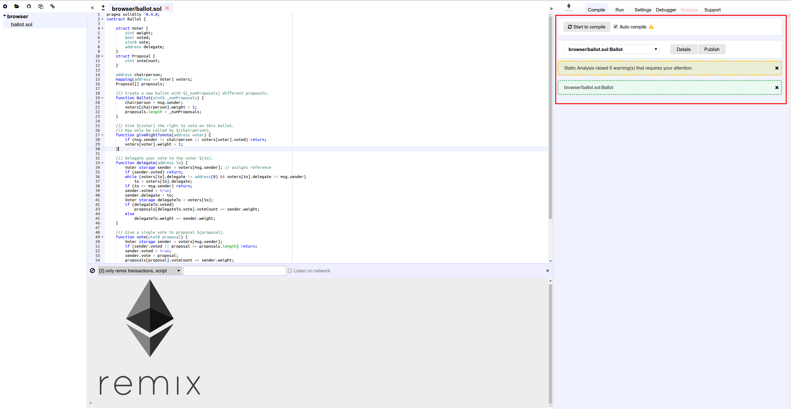

Compiling contracts
===================

By default Remix triggers a compilation each time the current file is changed or another file is selected.
If the contract has a lot of dependencies and takes a long time to compile, it is possible to disable the `autocompilation`.

After each compilation, a list is updated with all the newly compiled contracts.

`Details` modal dialog displays detailed information about the current selected contract.

From this tab, you can also publish your contract to Swarm (only non abstract contracts can be published).

Published data notably contains the ``abi`` and solidity source code.

After a contract is published, you can find its metadata information using the `bzz` URL located in the details modal dialog ``SWARM LOCATION``.

Compilation Errors and Warning are displayed below the contract section. At each compilation, the static analysis tab builds a report. It is very valuable when addressing reported issues even if the compiler doesn't complain.
(see :doc:`../analysis_tab`)
