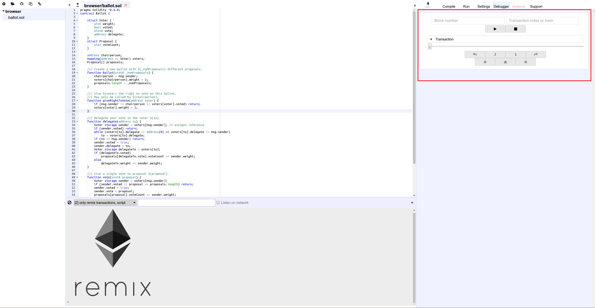

Debugging
=========

This module allows you to debug the transaction.
It can be used to deploy transactions created from Remix and already mined transactions.
(debugging works only if the current environment provides needed features).

All informations about debugging are describing in the following link:
:doc:`../tutorial_debug`
