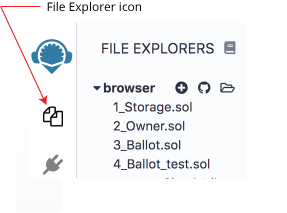
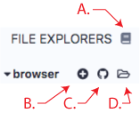

File Explorer
=============

To get to the file explorers - click the file explorers icon.

The file explorer lists by default all the files stored in your browser.
You can see them in the browser folder. You can always rename, remove or
add new files to the file explorer.

Note that clearing the browser storage will permanently delete all the
solidity files you wrote. To avoid this, you can use Remixd, which
enables you to store and sync files in the browser with your local
computer (for more information see ../tutorial\_remixd\_filesystem)

We will start by reviewing at the icons at the top left - from left to
the right:

Create new File
---------------

Creates a new `untitled.sol` file in Remix.

Add Local File
--------------

Allows you to select files from the local file system and import them to
the Remix browser storage.

Publish to Gist
---------------

Publishes all files from the browser folder to a gist.
Gist API has changed in 2018 and it unfortunately requires users to be authenticated to be able to publish a gist.

Click [this link](https://github.com/settings/tokens) to Github tokens setup  and select Generate new token.
Then check only Create gists checkbox and generate a new token.

Then paste it in Remix (right panel/Settings tab) and click Save. Now you should be able to use the feature.

Copy to another Remix instance
------------------------

Enables you to copy files from the browser storage to another instance
(URL) of Remix.

Connect your filesystem to Remix
--------------------

Allows to sync between Remix and your local file system (see
[more about RemixD](http://remix.readthedocs.io/en/latest/tutorial_remixd_filesystem.html)).
