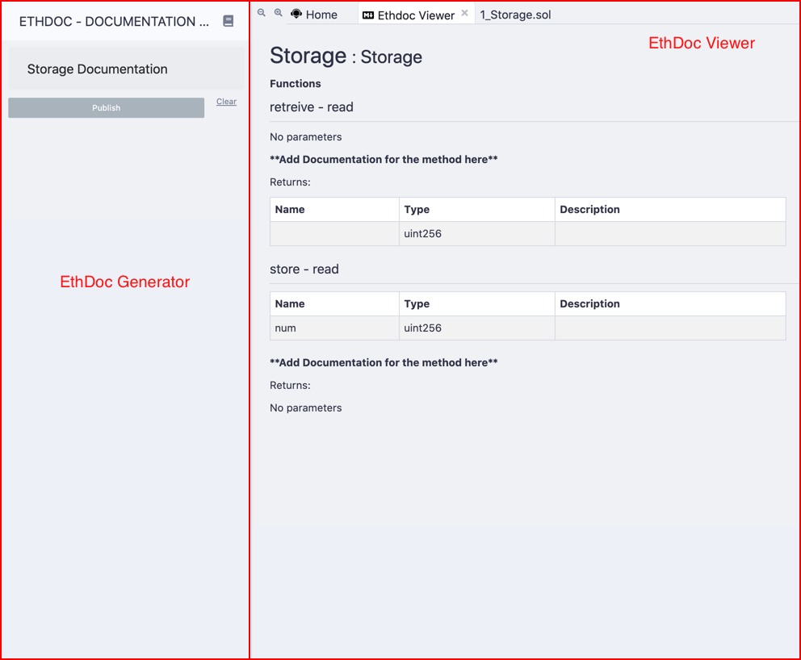

# Remix EthDoc Plugin

The Remix EthDoc plugin allow you to generate HTML documents from solidity smart contracts. It also gives you the capability to publish the generated HTML documents to IPFS.

## Activate

This plugin consist of 2 parts, what is call the EthDoc viewer and the EthdDoc generator. Internally the EthDoc Generator will activate the EthDoc viewer, so you only need to go to the plugins section and find EthDoc, then activate it and automatically EthDoc viewer will be active.

The following image illustrate both sections of the plugin.

The EthDoc viewer appears in a tab in the main area of the Remix Editor and the EthDoc generator will appear in the side panel.

## How to generate documentation

To generate HTML documents, the first thing you need to do is to compile smart contracts.

Once the contracts are compiled, go to the EthDoc plugin section and you can select and preview the HTML documents that were generated.

## How to publish

In order to publish an HTML document, you need to first select a generated HTML document and then click the "Publish" button.

Then, you should be redirected to the published version of the HTML document.

## Issues

If you have any issues, please feel free to create an issue in our [Github repository](https://github.com/Machinalabs/remix-ethdoc-plugin/issues).