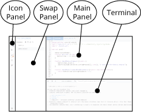
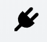

Remix-IDE Layout
==============

The new structure
--------------------

1. Icon Panel - click to change which plugin appears in the Swap Panel
2. Swap Panel - Most but not all plugins will have their GUI here.
3. Main Panel - In the old layout this was just for editing files.  In the tabs can be plugins or files for the IDE to compile.
4. Terminal - where you will see the results of your interactions with the GUI's.  Also you can run scripts here.

Icon Panel at Page Load
-----------------------
When you load remix - the icon panel show these icons by default.

Everything in remix is now a plugin...  so the **Plugin Manager** is very important.
In the old layout, each basic task in remix was separated into the tabs.  Now these tabs are plugins.  

But to load up 5 or 6 of plugins each time the page load can be **tedious**.  So learn about the **Environmentse**.

Homepage
--------

The homepage is located on a tab in the Main Panel.  You can also get there from the top of the settings screen in the swap panel.

### Environments
Clicking on one of the environment buttons loads up a collection of plugins.  We currently have a **Solidity** Button and a **Vyper** button.  In the future you will be able to save your own environment.

To see all the plugins go to the **plugin manager** - by selecting the plug in the icon panel. 
 

The environment buttons are time & sanity savers - so you don't need to go to the plugin manager to get started everytime you load the page.   

Plugin Manager
---------------

In order to make remix flexible for integrating changes into its functionality, we've now made everything a plugin.  This means that you need to go turn off and turn on all the plugins.
