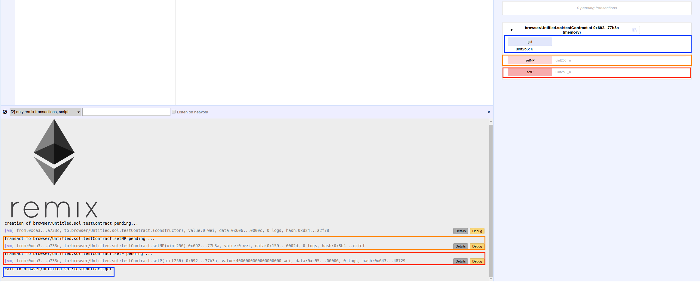

Quick Start using the JavaScript VM
===================================

There are 3 type of environments Remix can be plugged to (see :doc:`../run_tab`)
both ``Web3 provider`` and ``Injected provider`` requires the use of an external tool.

An Ethereum node for ``Web3 provider`` and Mist or Metamask for ``Injected provider``.

The ``JavaScript VM`` mode is convenient because every execution run in your browser.
Thus reloading the page will restart Remix with en empty state. it might also be better to use an external node for better performances.

Selecting the VM mode
---------------------

Make sure the VM mode is selected. All accounts displayed in ``Accounts`` should have 100 ether.

Sample contract
---------------

.. code-block:: none
    
    pragma solidity ^0.4.16;
    contract testContract {
        
        uint value;
        function testContract(uint _p) {
            value = _p;
        }
        
        function setP(uint _n) payable {
            value = _n;
        }
        
        function setNP(uint _n) {
            value = _n;
        }
        
        function get () constant returns (uint) {
            return value;
        }
    }
    
That contract is very very basic, the goal is to quiclky start to create and to interact with.

Deploying an instance
---------------------

The ``Compile tab`` displays informations related to the current contract (note that there can be more than one) (see :doc:`../compile_tab`).

Switching now to ``Run tab`` allows to deploy an instance of the contract in the ``JavaScript VM`` state.

.. image:: images/remix_quickstart_javascriptvm_creation.png

The constructor of ``testContract`` needs a parameter (of type ``uint``). give any value and click on ``Create``.

The transaction which deploy the instance of ``testContract`` is created.

That could take several seconds in a "normal" blockchain (time for the transaction to be mined), in our the case execution is immediate (JavaScript VM).
 
Looking at the terminal will inform you about the transaction. You can see details and start debugging it.

The newly created instance is displayed in the ``run tab``.

.. image:: images/remix_quickstart_javascriptvm_creationTransaction.png

Interacting with an instance
----------------------------

This new instance contains 3 actions which corresponds to the 3 functions (``setP``, ``setPN``, ``get``).
Clicking on ``SetP`` or ``SetPN`` will create a new transaction. 

Note that ``SetP`` is ``payable`` (red action) : it is possible to send value (Ether) to the contract.

``SetPN`` is not payable (light red action) : it is not possible to send value (Ether) to the contract.

Clicking on ``get`` will not execute a transaction (blue action). It is not necessary to do so because ``get`` does not modify the state (variable ``value``) of this instance.

As ``get`` is ``constant`` you can see the return value just below the action.

   
   