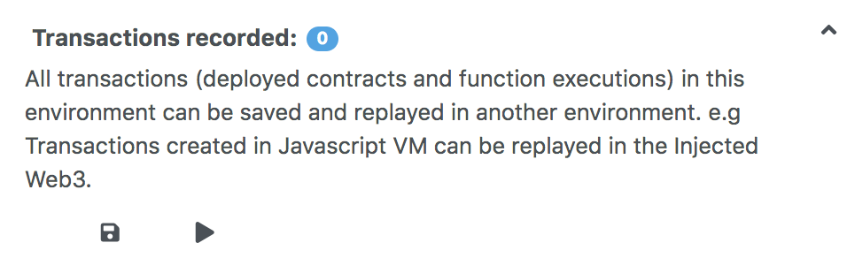

Deploy & Run
============

 The Deploy & Run module allows you to send transactions to the current environment.

To use this module, you need to have a contract compiled.  So, if there is a contract name in the <b>CONTRACT</b> select box (the select box is under the VALUE input field), you can use this module.  If nothing is there or you do not see the contract you want, you need to select a contract in the editor to make it active, go to a compiler module and compile it, and then come back to Deploy & Run.


Environment
---------

-   `JavaScript VM`: All the transactions will be executed in
    a sandbox blockchain in the browser. This means nothing
    will be persisted when you reload the page. The JsVM is its own blockchain and on each reload it will start a new blockchain, the old one will not be saved.

-   `Injected Provider`: Remix will connect to an injected
    web3 provider. `Metamask` is an example of a provider that inject web3.

-   `Web3 Provider`: Remix will connect to a remote node. You will need to provide the URL to the selected provider: geth, parity or any Ethereum client. 

More about Web3 Provider
-------------
If you are using Geth & https://remix.ethereum.org, please use the following Geth command to allow requests from Remix:

**geth --rpc --rpccorsdomain https://remix.ethereum.org**

Also see [Geth Docs about the rpc server](https://geth.ethereum.org/docs/rpc/server)

To run Remix using  https://remix.ethereum.org & a local test node, use this Geth command:

**geth --rpc --rpccorsdomain="https://remix.ethereum.org" --rpcapi web3,eth,debug,personal,net --vmdebug --datadir <path/to/local/folder/for/test/chain> --dev console**

If you are using remix-alpha or a local version of remix - replace the url of the --rpccorsdomain with the url of Remix that you are using. 

To run Remix Desktop & a local test node, use this Geth command:

**geth --rpc --rpccorsdomain="package://a7df6d3c223593f3550b35e90d7b0b1f.mod" --rpcapi web3,eth,debug,personal,net --vmdebug --datadir <path/to/local/folder/for/test/chain> --dev console**

Also see [Geth Docs on Dev mode](https://geth.ethereum.org/getting-started/dev-mode)

The Web3 Provider Endpoint for a local node is **http://localhost:8545**

---

**WARNING:** Don't get lazy. It is a bad idea to use the Geth flag <b>--rpccorsdomain</b> with a wildcard: `--rpccorsdomain *`

If you put the wildcard `*`, it means everyone can request the node. Whereas, if you put a URL, it restricts the urls to just that one - e.g.  `--rpccorsdomain 'https://remix-alpha.ethereum.org'`

Only use `--rpccorsdomain *` when using a **test chain** AND using only **test accounts**. For real accounts or on the mainchain **specify the url**.

--- 
      

Account:
--------
-   Account: the list of accounts associated with the current
     environment (and their associated balances).  On the JsVM, you have a choice of 5 accounts.  If using Injected Web3 with MetaMask, you need to change the account in MetaMask.

Gas Limit:
---------
-   This sets the maximum amount of gas that will be allowed for all the
     transactions created in Remix.

Value:
-----
-   This sets the amount of ETH, WEI, GWEI etc that is sent to a contract or a payable function.  ( Note: payable functions have a red button). The value is always reset to 0 after each transaction execution). The Value field is **NOT** for gas.  

 

Initiate Instance
-----------------

-   In the image above, the select box is set to Ballot.  This select box will contain the list of compiled contracts.

-   `Deploy` send a transaction that deploys the selected contract. When
    the transaction is mined, the newly created instance will be added
    (this might take several seconds). Note that if the `constructor`
    has parameters, you need to specify them.

-   `At Address` this is used at access a contract that has already been deployed. It assumes that the given address is an instance of the selected contract.  **Note:** There's no check at this point, so be careful when using this feature, and be sure you trust the contract at that address.


Pending Instances
-----------------

Validating a transaction takes several seconds. During this time, the GUI
shows it in a pending mode. When the transaction is mined, the number of
pending transactions is updated and the transaction is added to the log
([see terminal](terminal.html)).

Using the ABI
------------

Using `Deploy` or `At Address` is a classic use case of Remix. However, it is
possible to interact with a contract by using its ABI. The ABI is
a JSON array which describe its interface.

To interact with a contract using the ABI, create a new file in Remix
with extension `*.abi` and copy the ABI content to it. Then, in the input
next to `At Address`, put the Address of the contract you want to
interact with. Click on `At Address`, a new "connection" with the
contract will popup below.

Using the Recorder
------------------

The Recorder is a tool used to save a bunch of transactions in a JSON file and
rerun them later either in the same environment or in another.

Saving to the JSON file ( by default its called scenario.json) allows one to easily check the transaction list, tweak input parameters, change linked library, etc...

There are many use cases for the recorder.  

For instance:

-   After having coded and tested contracts in a constrained
    environment (like the JavaScript VM), you could then change the environment and redeploy it to a more realistic environment like a test net with an **injected web3** or to a Geth node. By using the generated **scenario.json** file, you will be using all the same settings that you used in the Javascript VM.  And this mean that you won't need to click the interface 100 times or whatever to get the state that you achieved originally.  So the recorder could be a tool to protect your sanity.
    
    You can also change the settings in the scenario.json file to customize the playback.

-   Deploying contract does often require more than creating one
    transaction and so the recorder will automate this deployment.

-   Working in a dev environment often requires to setup the
    state in a first place.  



### scenario.json
To create this file in the recorder, you first of course need to have run some transactions.  In the image above - it has a `0` next to **Transactions Recorded**.  So this isn't the right moment to save transactions because - well because there aren't any.  Each time you make a transaction, that number will increment.  Then when you are ready, click the floppy disk icon and the scenario.json file will be created.

The JSON file below is an example of the scenario.json file.

In it, 3 transactions are executed:

The first corresponds to the deployment of the lib `testLib`.

The second corresponds to the deployment of the contract `test` with the
first parameter of the constructor set to 11. That contract depends
on a library. The linkage is done using the property `linkReferences`.
In that case we use the address of the previously created library :
`created{1512830014773}`. The number is the id (timestamp) of the
transaction that led to the creation of the library.

The third record corresponds to the call to the function `set` of the
contract `test` (the property to is set to: `created{1512830015080}`) .
Input parameters are `1` and
`0xca35b7d915458ef540ade6068dfe2f44e8fa733c`

All these transactions are created using the value of the accounts
`account{0}`.

``` 
{
"accounts": {
    "account{0}": "0xca35b7d915458ef540ade6068dfe2f44e8fa733c"
},
"linkReferences": {
    "testLib": "created{1512830014773}"
},
"transactions": [
    {
    "timestamp": 1512830014773,
    "record": {
        "value": "0",
        "parameters": [],
        "abi": "0xbc36789e7a1e281436464229828f817d6612f7b477d66591ff96a9e064bcc98a",
        "contractName": "testLib",
        "bytecode": "60606040523415600e57600080fd5b60968061001c6000396000f300606060405260043610603f576000357c0100000000000000000000000000000000000000000000000000000000900463ffffffff1680636d4ce63c146044575b600080fd5b604a6060565b6040518082815260200191505060405180910390f35b6000610d809050905600a165627a7a7230582022d123b15248b8176151f8d45c2dc132063bcc9bb8d5cd652aea7efae362c8050029",
        "linkReferences": {},
        "type": "constructor",
        "from": "account{0}"
    }
    },
    {
    "timestamp": 1512830015080,
    "record": {
        "value": "100",
        "parameters": [
        11
        ],
        "abi": "0xc41589e7559804ea4a2080dad19d876a024ccb05117835447d72ce08c1d020ec",
        "contractName": "test",
        "bytecode": "60606040526040516020806102b183398101604052808051906020019091905050806000819055505061027a806100376000396000f300606060405260043610610062576000357c0100000000000000000000000000000000000000000000000000000000900463ffffffff1680632f30c6f61461006757806338cc48311461009e57806362738998146100f357806387cc10e11461011c575b600080fd5b61009c600480803590602001909190803573ffffffffffffffffffffffffffffffffffffffff16906020019091905050610145565b005b34156100a957600080fd5b6100b1610191565b604051808273ffffffffffffffffffffffffffffffffffffffff1673ffffffffffffffffffffffffffffffffffffffff16815260200191505060405180910390f35b34156100fe57600080fd5b6101066101bb565b6040518082815260200191505060405180910390f35b341561012757600080fd5b61012f6101c4565b6040518082815260200191505060405180910390f35b8160008190555080600160006101000a81548173ffffffffffffffffffffffffffffffffffffffff021916908373ffffffffffffffffffffffffffffffffffffffff1602179055505050565b6000600160009054906101000a900473ffffffffffffffffffffffffffffffffffffffff16905090565b60008054905090565b600073__browser/ballot.sol:testLib____________636d4ce63c6000604051602001526040518163ffffffff167c010000000000000000000000000000000000000000000000000000000002815260040160206040518083038186803b151561022e57600080fd5b6102c65a03f4151561023f57600080fd5b505050604051805190509050905600a165627a7a72305820e0b2510bb2890a0334bfe5613d96db3e72442e63b514cdeaee8fc2c6bbd19d3a0029",
        "linkReferences": {
        "browser/ballot.sol": {
            "testLib": [
            {
                "length": 20,
                "start": 511
            }
            ]
        }
        },
        "name": "",
        "type": "constructor",
        "from": "account{0}"
    }
    },
    {
    "timestamp": 1512830034180,
    "record": {
        "value": "1000000000000000000",
        "parameters": [
        1,
        "0xca35b7d915458ef540ade6068dfe2f44e8fa733c"
        ],
        "to": "created{1512830015080}",
        "abi": "0xc41589e7559804ea4a2080dad19d876a024ccb05117835447d72ce08c1d020ec",
        "name": "set",
        "type": "function",
        "from": "account{0}"
    }
    }
],
"abis": {
    "0xbc36789e7a1e281436464229828f817d6612f7b477d66591ff96a9e064bcc98a": [
    {
        "constant": true,
        "inputs": [],
        "name": "get",
        "outputs": [
        {
            "name": "",
            "type": "uint256"
        }
        ],
        "payable": false,
        "stateMutability": "view",
        "type": "function"
    }
    ],
    "0xc41589e7559804ea4a2080dad19d876a024ccb05117835447d72ce08c1d020ec": [
    {
        "constant": true,
        "inputs": [],
        "name": "getInt",
        "outputs": [
        {
            "name": "",
            "type": "uint256"
        }
        ],
        "payable": false,
        "stateMutability": "view",
        "type": "function"
    },
    {
        "constant": true,
        "inputs": [],
        "name": "getFromLib",
        "outputs": [
        {
            "name": "",
            "type": "uint256"
        }
        ],
        "payable": false,
        "stateMutability": "view",
        "type": "function"
    },
    {
        "constant": true,
        "inputs": [],
        "name": "getAddress",
        "outputs": [
        {
            "name": "",
            "type": "address"
        }
        ],
        "payable": false,
        "stateMutability": "view",
        "type": "function"
    },
    {
        "constant": false,
        "inputs": [
        {
            "name": "_t",
            "type": "uint256"
        },
        {
            "name": "_add",
            "type": "address"
        }
        ],
        "name": "set",
        "outputs": [],
        "payable": true,
        "stateMutability": "payable",
        "type": "function"
    },
    {
        "inputs": [
        {
            "name": "_r",
            "type": "uint256"
        }
        ],
        "payable": true,
        "stateMutability": "payable",
        "type": "constructor"
    }
    ]
}
}
```
