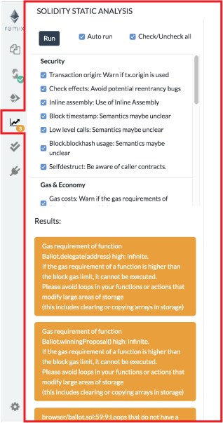

Solidity Static Analysis
========================

Static code analysis is a process to debug the code by examining it and without actually executing the code. 

`Solidity Static Analysis` plugin performs static analysis on Solidity smart contracts once they are compiled. It helps to check security vulnerabilities and bad development practices. This plugin comes with `Solidity` environment of Remix IDE. It can also be activated individually from `Plugin Manager`.

How to use
------------

If you select this plugin, you will see a number of modules listed along with checkboxes, one `Auto run` checkbox and a `Run` button.

By default, all modules are selected for analysis and a new analysis is performed at each compilation.

One can select/deselect the modules under which contract should be analyzed and can run the analysis again for last compiled contract by clicking on `Run`.

If you don't want to run analysis each time you compile a contract, just uncheck the checkbox near to `Auto run`.

Analysis Modules
-----------------
Currently, with Remix IDE v0.10.1, there are 21 analysis modules listed under 4 categories. Categories are: `Security`, `Gas & Economy`, `ERC` & `Miscellaneous`.

Here is the list of modules under each category:

### Category: Security
-   Transaction origin: Warns if tx.origin is used
-   Check effects: Avoid potential reentrancy bugs
-   Inline assembly: Use of Inline Assembly
-   Block timestamp: Semantics maybe unclear
-   Low level calls: Semantics maybe unclear
-   Block.blockhash usage: Semantics maybe unclear

### Category: Gas & Economy
-   Gas costs: Warns if the gas requirements of the functions
    are too high
-   This on local calls: Invocation of local functions via
    this

### Category: ERC

### Category: Miscellaneous
-   Constant functions: Checks for potentially constant
    functions
-   Similar variable names: Checks if variable names are too
    similar
