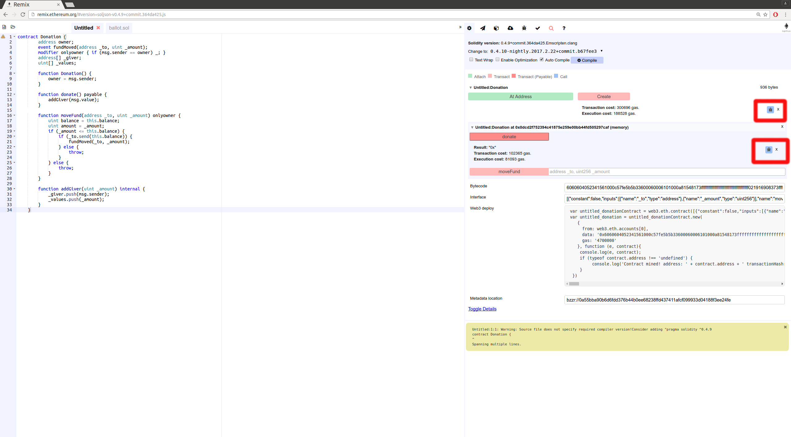
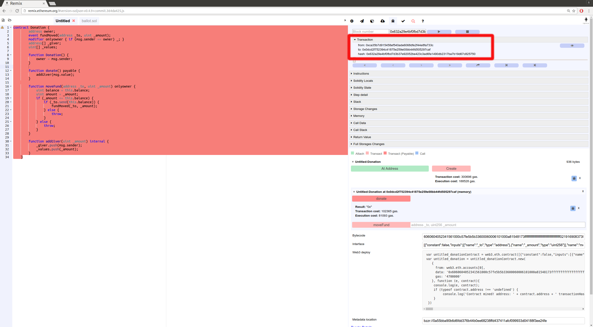
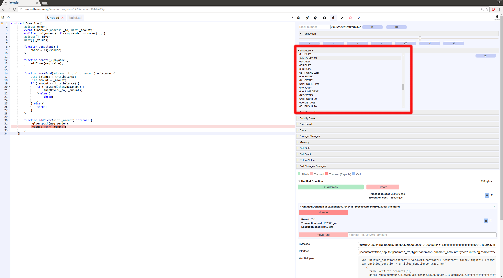
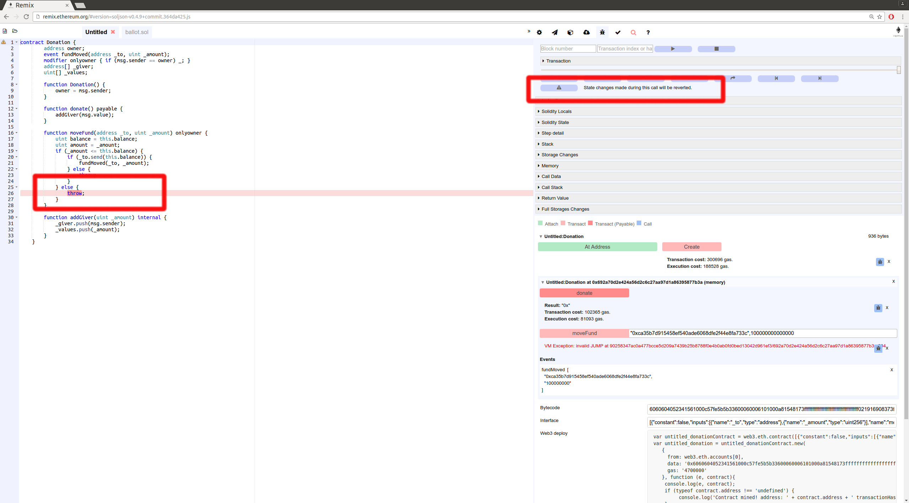
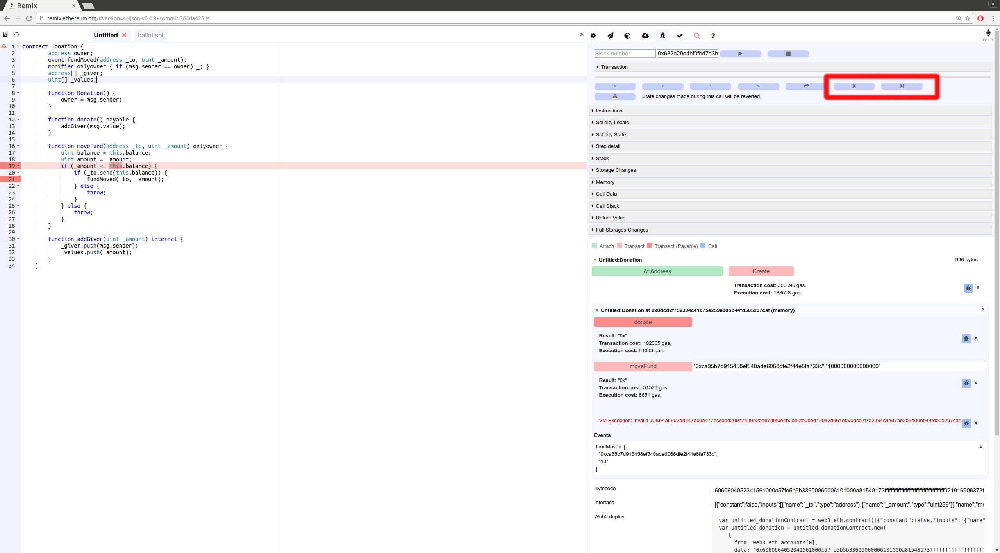

Debugging a Transaction
=======================

.. _tutorial-debug:

The goal of this tutorial is to explain how to debug transaction using Remix.

Start debugging
---------------

There are two different ways to start debugging, each way correspond to a different use case.

From the Transaction GUI
~~~~~~~~~~~~~~~~~~~~~~~~

We will not explain in detail here how to write or deploy contract.
Let us start with a basic contract (replace this one by your's):

.. code-block:: none

    contract Donation {
        address owner;
        event fundMoved(address _to, uint _amount);
        modifier onlyowner { if (msg.sender == owner) _; }
        address[] _giver;
        uint[] _values;
        
        function Donation() {
            owner = msg.sender;
        }
        
        function donate() payable {
            addGiver(msg.value);
        }
    
        function moveFund(address _to, uint _amount) onlyowner {
            uint balance = this.balance;
            uint amount = _amount;
            if (_amount <= this.balance) {
                if (_to.send(this.balance)) {
                    fundMoved(_to, _amount);    
                } else {
                    throw;
                }
            } else {
                throw;
            }
        }
        
        function addGiver(uint _amount) internal {
            _giver.push(msg.sender);
            _values.push(_amount);
        }
    }
    
For the purpose of this tutorial, we will run the ``JavaScript VM`` (that's the default mode when you don't use Remix with Mist or Metamask).  This simulates a custom blockchain. You could do the same using a proper backend node.

Now, let's deploy the contract:

Right panel / Red button ``Create``

.. image:: remix1.png

Then we should call the ``Donate`` function (that will send Ether to the contract). 

Let's set the amount of Ether:

Right panel / second tab from the left - fill in the ´´value´´ input (´1 ether´ for instance)

.. image:: remix_valueinput.png

Then click on ``Donate``. As we are using the ``JavaScript VM``, everything goes almost instantly.

Remix displays also some information related to each transaction result. In the terminal, the transaction is logged and you can start debugging it.

From the Debugger
~~~~~~~~~~~~~~~~~

The debugger can be found in the right panel / 5th tab from the left.

You can start a debug session by providing either a ``transaction hash`` or a ``block number`` and ``transaction index``.

.. image:: remix3.png

Click the ``play`` button to start debugging.

Using the debugger
------------------

The debugger allows one to see detailed informations about the transaction's execution. It uses the editor (left panel) to display the location 
in the source code where the current execution is.

The transaction panel displays basic information about the current transaction.

The navigation part contains a slider and buttons that can be used to step through the transaction execution.

From the left to the right: 

step over back, step into back, step into forward, step over forward, jump out (jump out of the current call), jump to the previous breakpoint, jump to the next breakpoint.

.. image:: remix_navigation.png

11 panels give detailed information about the execution:

Instructions
~~~~~~~~~~~~

The Instructions panel displays the bytecode of the current executing contract- with the current step highlighted.

Important note: 
When this panel is hidden, the slider will have a courser granularity and only stop at expression boundaries, even if they are compiled into multiple EVM instructions.
When the panel is displayed, it will be possible to step over every instruction, even those that refers to the same expression.

Solidity Locals
~~~~~~~~~~~~~~~

.. image:: remix_soliditylocals.png

The Solidity Locals panel displays local variables associated with the current context.

Solidity State
~~~~~~~~~~~~~~

.. image:: remix_soliditystate.png

The Solidity State panel displays state variables of the current executing contract.

Low level panels
~~~~~~~~~~~~~~~~

These panels display low level informations about the execution:

 - Stack
 - Storages Changes
 - Memory
 - Call Data
 - Call Stack
 - Return Value (only if the current step is a RETURN opcode)
 - Full Storages Changes (only at the end of the execution - display every storage change of every modified contract)
 
Reverted Transaction
~~~~~~~~~~~~~~~~~~~~

A transaction could be reverted (either because of out of gas exception, Solidity ``throw`` or low level exception).

In that case it is important to be aware of the exception and to locate where the exception is in the source code.

Remix will warn you when the execution throws an exception. The ``warning`` button will jump to the last opcode before the exception happened.

Breakpoints
~~~~~~~~~~~

The two last buttons from the navigation area are used to jump either back to the previous breakpoint or forward to the next breakpoint.

Breakpoints can be added and removed by clicking on the line number.

When a debug session is started, the execution will jump to the first encountered breakpoint.

Important note: 
If you add a breakpoint to a line that declares a variable, it might be triggered twice: Once for initializing the
variable to zero and second time for assigning the actual value.
As an example, assume you are debugging the following contract:

.. code-block:: none

    contract ctr {
        function hid () {
            uint p = 45;
            uint m;
            m = 89;
            uint l = 34;
        }
    }
    
And let's says that breakpoints are set for the lines 

``uint p = 45;``

``m = 89;``

``uint l = 34;``

then clicking on ``Jump to next breakpoint`` will stop at the following lines in the given order:

 ``uint p = 45;``   (declaration of p)
 
 ``uint l = 34;``   (declaration of l)
 
 ``uint p = 45;``   (45 assigned to p)
 
 ``m = 89;``    (89 assigned to m)
 
 ``uint l = 34;``   (34 assigned to l)
