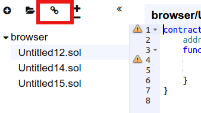
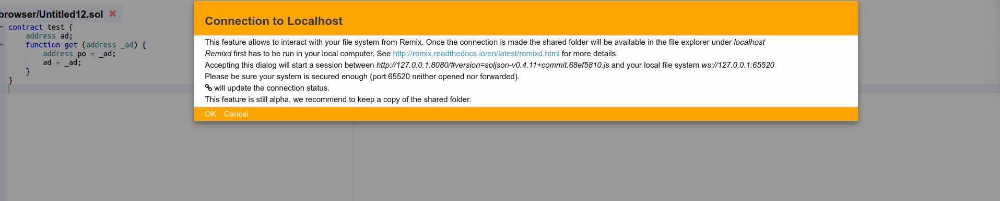

Access your local filesystem by using RemixD
===================================================

RemixD is an npm module. Its purpose is to give the remix web
application access to a folder from your local computer.

The code of RemixD can be checked out
[here](https://github.com/ethereum/remixd) .

Remixd can be globally installed using the following command:
`npm install -g remixd`.

Then `remixd -s <absolute-path-to-the-shared-folder>` will start Remixd
and share the given folder.

The folder is shared using a websocket connection between `Remix IDE`
and `Remixd`.

Be sure the user executing Remix has read/write permission on the
folder.

**Warning!**

RemixD provides `full read and write access` to the given folder for `any
application` that can access the `TCP port 65520` on your local host.

From `Remix IDE`, you will need to activate the connection.

Click on the `localhost connection` icon:

A modal dialog will ask confirmation

Accepting this dialog will start a session. Once the connection is made,
the status will update and the connection icon should shows up in green.

Hovering the icon will give more connection status information.

At this point if the connection is successful, the shared folder will be
available in the file explorer.

