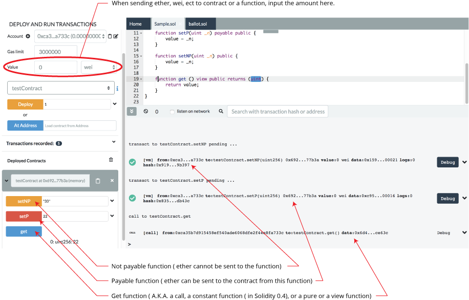
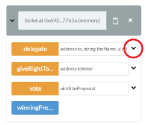
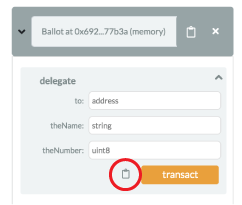

Run & Deploy (part 2)
=====================

## Deployed contracts

This section in the Run tab contains a list of deployed contracts to interact with through autogenerated UI of the deployed contract (also called udapp).

The deployed contract appears but is in its collapsed form.


Click the sideways caret to open it up.


You will see the functions in the contract.  The functions buttons can have different color buttons.

-   Functions that are `constant` or `pure` functions in Solidity have a blue buttons. Clicking one of this type does not create a new transaction. So clicking will not cause state changes - it will only return a value stored in the contract - so it won't cost you anything in gas fees.

-   Functions that change the state of the contract AND that do not accept Ether are called `non-payable` functions and have an orange button. Clicking on them will create a transaction and thus cost gas.

-   Functions that have red buttons are `payable` functions in Solidity. Clicking one of these will create a new transaction and this transaction can accept a **value**.  The **value** is put in in the Value field which is under the Gas Limit field.




For more information see more about [Solidity
modifier](http://solidity.readthedocs.io/en/develop/miscellaneous.html?highlight=pure#modifiers)
.

If a function requires input parameters, well.. you gotta put them in.

## Inputting parameters



### Inputting parameters in the collapsed view

(Inputting all the parameters in a single input box)
+ The input box tells you what type each parameter needs to be.
+ Numbers and addresses do not need to be wrapped in double quotes.  
+ Strings need to be wrapped.
+ Parameters are separated by commas.

In the example above the "delegate" function has 3 parameters.

### Inputting parameters in the expanded view
Clicking the 'down' caret brings you to the *Multi-param Manager* - where you can input the parameters one at a time. **Much less confusing!**



In the expanded view, strings do not need to be wrapped.  

Clicking the clipboard icon will encode the inputs and will copy them.  Only a valid set of inputs can be encoded.  

So if you made a mistake and put a uint8 where an address should have been, clicking the clipboard here will give you an error.


### Inputting structs in the expanded view
For inputting a struct, the easiest way is to use array []

If the struct members have names, using js object should work {name: value, name1: value}

For example, if the struct is:

```
struct r 
{
   string t,
   uint r
}
```

You can use:

["this is a string", 23]
