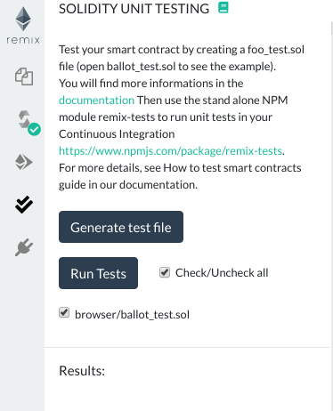
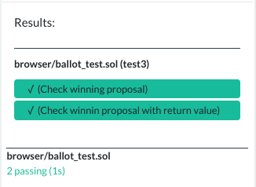

Unit Testing Plugin
============

Click the

 icon to get to the "Solidity Unit Testing" plugin. 
 
 If you haven't used this plugin before and are not seeing `double check` icon, you have to activate it from Remix plugin manager.
 
Go to the plugin manager (by click the  icon) and load up the unit testing plugin.

Now `double check` icon will appear on the left side icon bar. Clicking on icon will load the unit testing module in the side panel.

Generate Test File
------------------
Click the button `Generate test file` to create a new solidity file in the current folder suffixed with `_test`. This file contains the minimum you need for running unit testing.

Write Tests
-----------
Write tests to check the functionality of your contract. Remix injects a built-in `assert` library which can be used for testing. Visit the library documentation [here](./assert_library).

Apart from this, Remix allows usage of some special functions to make testing more structural. They are:

* `beforeEach()` - Runs before each test
* `beforeAll()` - Runs before all tests
* `afterEach()` - Runs after each test
* `afterAll()` - Runs after all tests

To get started, see [this](https://github.com/ethereum/remix/blob/master/remix-tests/tests/examples_4/SafeMath_test.sol) for sample implementation.

Run Tests
------------------

Click the button "Run tests" to executes all tests whose box has been checked below (by default all). The execution is run in a separate environment and the result is displayed below.

Continuous integration
----------------------

remix-tests is also a CLI, it can be used in a continuous integration environment which support node.js.
Please find more information in the [remix-tests repository](https://github.com/ethereum/remix/tree/master/remix-tests)

See also: example [Su Squares contract](https://github.com/su-squares/ethereum-contract/tree/e542f37d4f8f6c7b07d90a6554424268384a4186) and [Travis build](https://travis-ci.org/su-squares/ethereum-contract/builds/446186067) that uses remix-tests for continuous integration testing.
