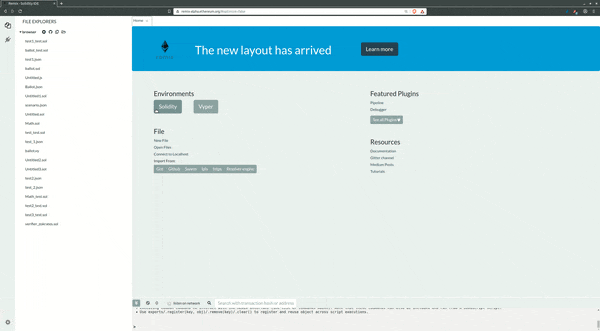

# Plugin Core

This is the core library used to create a new external plugin.

| Name                       | Latest Version       |
| ---------------------------| :------------------: |
| [@remixproject/plugin](.)  | [](https://www.npmjs.com/package/@remixproject/plugin) |

Use this library if you want to create a plugin **for a new environment**.

If you want to create a plugin in an existing envrionment, use the specific library. For example : 
- Plugin on an iframe: [@remixproject/plugin-iframe](../iframe)
- Plugin on a node child-process: [@remixproject/plugin-child-process](../child-process)
- Plugin on an vscode extension or webview : [@remixproject/plugin-vscode](../vscode)

## API

| API                     | Description                                   |
| ------------------------| :-------------------------------------------: |
| [PluginClient](./api)   | Entry point to communicate with other plugins |


-----------

## Getting Started

> This getting started is for building **iframe based plugin** (only supported by remix-ide for now).

Installation :
```bash
npm install @remixproject/plugin-iframe
```

or with a unpkg :
```html
<script src="https://unpkg.com/@remixproject/plugin"></script>
```

### Plugin Client
The plugin client is how you connect your plugin to remix.

To import ( the ES6 way) with NPM use:
```javascript
import { createClient } from '@remixproject/plugin'
const client = createClient()
```
Or if you are using unpkg use:
```javascript
const { createClient } = remixPlugin
const client = createClient()
```


## Test inside Remix IDE
To test your plugin with remix:
1. Go to http://remix-alpha.ethereum.org. (if your localhost is over HTTP, you need to use http for Remix IDE).
2. Click on the plugin manager (Plug icon on the left).
3. Click on "Connect to a Local Plugin".
4. Fill the profile info of you plugin ().
5. Click on "ok".
6. A new icon should appear on the left, this is where you can find you plugin.


<div align="center">
  
</div>


### Testing your plugin
You can test your plugin direcly on the [alpha version of Remix-IDE](https://remix-alpha.ethereum.org). Go to the `pluginManager` (plug icon in the sidebar), and click "Connect to a Local Plugin".

Here you can add :
- A name : this is the name used by other plugin to listen to your events.
- A displayName : Used by the IDE.
- The url : May be a localhost for testing.

> Note: No need to do anything if you localhost auto-reload, a new `handshake` will be send by the IDE.


## Status
Every plugin has a status object that can display notifications on the IDE. You can listen on a change of status from any plugin using `statusChanged` event :

```typescript
client.on('fileManager', 'statusChanged', (status: Status) => {
  // Do Something 
})
```

The status object is used for displaying a notification. It looks like that :
```typescript
interface Status {
  key: number | 'edited' | 'succeed' | 'loading' | 'failed' | 'none'  // Display an icon or number
  type?: 'success' | 'info' | 'warning' | 'error'  // Bootstrap css color
  title?: string  // Describe the status on mouseover
}
```
- If you want to remove a status use the `'none'` value for `key`.
- If you don't define type, it would be the default value ('info' for Remix IDE).

You can also change the status of your own plugin by emitting the same event :
```typescript
client.emit('statusChanged', { key: 'succeed', type: 'success', title: 'Documentation ready !' })
```
> The IDE can use this status to display a notification to the user.


### Client Options

#### CSS Theme
Remix is using [Bootstrap](https://getbootstrap.com/). For better User Experience it's **highly recommanded** to use the same theme as Remix in your plugin. For that you _just_ have to use standard bootstrap classes.

Remix will automatically create a `<link/>` tag in the header of your plugin with the current theme used. And it'll update the link each time the user change the theme.

If you really want to use your own theme, you can use the `customTheme` flag in the option :
```typescript
const client = createClient({ customTheme: true })
```

#### Custom Api
By default `@remixproject/plugin` will use remix IDE api.
If you want to extends the API you can specify it in the `customApi` option.

A good use case is when you want to use an external plugin not maintained by Remix team (3box plugin for example): 

```typescript
import { remixProfiles, IRemixApi } from '@remixproject/plugin'
interface ICustomApi extends IRemixApi {
  box: IBox;
}

export type CustomApi = Readonly<ICustomApi>;

export type RemixClient = PluginClient<any, CustomApi> & PluginApi<CustomApi>;

const customApi: ProfileMap<RemixIDE> = Object.freeze({
  ...remixProfiles,
  box: boxProfile
});
const client = createClient({ customApi })
```

> You'll need Typescript > 3.4 to leverage the types.

#### DevMode
Plugins communicate with the IDE through the `postMessage` API. It means that `PluginClient` needs to know the origin of your IDE.

If you're developing a plugin with your IDE running on `localhost` you'll need to specify the port on which your IDE runs. By default the port used is *8080*. To change it you can do:
```typescript
const devMode = { port: 3000 }
const client = createClient({ devMode })
```